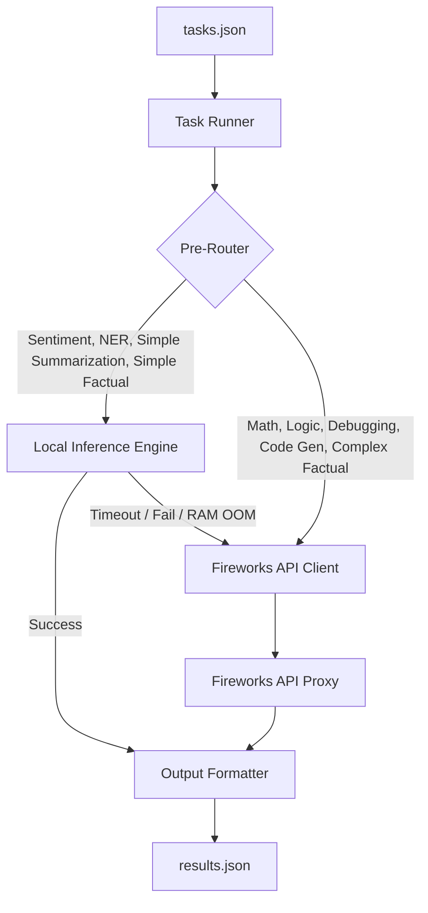

# AMD Developer Hackathon (Act II) - Track 1: General-Purpose AI Agent

This document outlines the detailed system architecture, routing strategy, edge-case handling, and implementation plan for building a highly optimized and accurate General-Purpose AI Agent.

---

## 1. System Architecture

The core challenge of Track 1 is balancing **Accuracy** and **Token Efficiency** under tight resource constraints (4 GB RAM, 2 vCPU, 10-minute timeout, and <30 seconds per request).

We propose a **Hybrid Routing Architecture**:
1. **Rule-Based Pre-Router**: A fast, zero-latency, zero-cost heuristic router that classifies incoming prompts into 8 capability categories based on keywords, regex, prompt length, and pattern matching.
2. **Local Inference Engine (Free Tier)**:
   - Runs a highly compressed, 4-bit quantized local model (e.g., `Qwen-2.5-1.5B-Instruct-GGUF` or `Llama-3.2-1B-Instruct-GGUF`) using `llama-cpp-python`.
   - Handles low-complexity and highly structured tasks (e.g., Sentiment Classification, Named Entity Recognition, Simple Summarization, Simple Factual).
   - Running locally consumes **zero Fireworks API tokens**, which directly optimizes our leaderboard score.
3. **Fireworks API Client (Premium Tier)**:
   - Configured dynamically via `FIREWORKS_BASE_URL` and `FIREWORKS_API_KEY`.
   - Selects the optimal model from `ALLOWED_MODELS` depending on the category.
   - For high-complexity tasks (e.g., Code Generation, Debugging, Logic, Complex Math), we route to larger models (e.g., 70B or 405B models) to guarantee clearing the accuracy gate.
   - Employs strict response formatting and system prompt optimization to minimize input and output token counts.

### Architecture Diagram



---

## 2. Directory Structure

We will initialize the project with the following structure:

```text
amd/
├── .git/
├── AGents.md                  # This documentation file
├── Dockerfile                 # Multi-stage Docker build targeting linux/amd64
├── requirements.txt           # Python dependencies
├── download_model.py          # Script run during Docker build to cache the local GGUF model
├── main.py                    # Entrypoint script that loads tasks and orchestrates execution
├── router/
│   ├── __init__.py
│   └── classifier.py          # Rule-based and heuristic task classification
├── local_engine/
│   ├── __init__.py
│   └── llama_client.py        # Local GGUF inference manager using llama-cpp-python
├── api_engine/
│   ├── __init__.py
│   └── fireworks_client.py    # Asynchronous Fireworks API client with token-saving prompts
└── utils/
    ├── __init__.py
    └── logger.py              # Centralized logging utility
```

---

## 3. Detailed Edge Case Analysis & Mitigation Strategies

| Edge Case | Description | Mitigation Strategy |
| :--- | :--- | :--- |
| **Missing or Malformed `tasks.json`** | Startup error if file does not exist, is empty, or is invalid JSON. | Wrap loading in `try-except`. Write `[]` to `/output/results.json` and exit with 0 to prevent pipeline crash. |
| **Strict Time Limit (< 30s per request)** | A request routed to the local model on 2 vCPUs may hang or run slow, exceeding 30s. | Wrap local inference in an asyncio timeout block (e.g., 20 seconds). If it times out, immediately abort local execution and fallback to the Fireworks API. |
| **Total Runtime Limit (10 minutes)** | Running 100+ tasks sequentially will exceed 10 minutes. | Process tasks concurrently using `asyncio.gather` with a semaphore (e.g., `asyncio.Semaphore(8)`) to balance CPU usage and API rate-limiting. |
| **Local Model Out of Memory (OOM)** | The container has a strict 4 GB RAM limit. A 3B or 7B model can easily OOM the container. | 1. Use a 1.5B or 1B model (Q4_K_M GGUF format) which requires < 1.2 GB RAM.<br>2. Set `n_ctx=512` or `1024` to limit context memory window.<br>3. Set `n_threads=2` to align with the 2 vCPU budget.<br>4. Monitor memory usage programmatically or implement a fallback if allocation fails. |
| **Model Violations (`ALLOWED_MODELS`)** | Using a hardcoded model that is not in the runtime `ALLOWED_MODELS` list invalidates the run. | 1. Read `ALLOWED_MODELS` from `os.environ` at runtime.<br>2. Map our model choices to what is available (e.g., if we want a 70B model, find the model in `ALLOWED_MODELS` containing `70b`). |
| **API Rate-Limiting (429 Too Many Requests)** | Flooding the Fireworks API with concurrent requests can cause failures. | Implement a robust retry decorator with exponential backoff and jitter (e.g., using `tenacity` or custom async retry logic). |
| **Malformed `/output/results.json`** | Missing `task_id` or `answer` fields or incorrect JSON format results in a zero score. | 1. Implement schema validation (Pydantic or JSON schema) before writing to the output file.<br>2. Ensure the output is written atomically (write to temp file, then rename) to prevent partial write corruption. |
| **Unseen Prompt Variants** | Over-fitting to the 8 practice tasks will fail on the hidden evaluation set. | Do not hardcode or cache answers. Use robust, generalized prompts for the API models and verify reasoning capabilities. |

---

## 4. Capability-Specific Strategies

### 1. Factual Knowledge
- **Strategy**: Simple queries (e.g., capitals, basic definitions) are routed locally. Complex queries (e.g., multi-part lookups) are routed to a medium-sized Fireworks model (e.g., `llama-3.1-8b-instruct`).
- **Prompt Optimization**: "Answer the question directly in 1-2 sentences. Avoid pleasantries."

### 2. Mathematical Reasoning
- **Strategy**: Always route to a larger Fireworks model (e.g., `llama-3.1-70b-instruct`) as math requires high precision.
- **Prompt Optimization**: "Solve the math problem step-by-step. Provide the final number clearly at the end."

### 3. Sentiment Classification
- **Strategy**: 100% routed to the local model.
- **Prompt Optimization**: "Classify the sentiment of the text as Positive, Negative, or Neutral. Provide a 1-sentence justification."

### 4. Text Summarisation
- **Strategy**: Route simple/short summarizations locally. Route long passages to a smaller Fireworks model (`llama-3.1-8b-instruct`).
- **Prompt Optimization**: Strictly enforce length constraints in the prompt (e.g., "Summarize in exactly one sentence").

### 5. Named Entity Recognition (NER)
- **Strategy**: Route to the local model using a strict format.
- **Prompt Optimization**: "Extract all named entities (Person, Organization, Location, Date) from the text. Format the output as a valid JSON list of objects: `[{\"entity\": \"...\", \"type\": \"...\"}]`."

### 6. Code Debugging
- **Strategy**: Always route to a premium Fireworks model (e.g., `llama-3.1-70b-instruct` or `qwen-2.5-72b-instruct`).
- **Prompt Optimization**: "Identify the bug, explain it briefly, and output the corrected code block."

### 7. Logical / Deductive Reasoning
- **Strategy**: Always route to a premium Fireworks model.
- **Prompt Optimization**: "Solve the logic puzzle step-by-step and state the final answer clearly."

### 8. Code Generation
- **Strategy**: Always route to a premium Fireworks model.
- **Prompt Optimization**: Use system prompts that inhibit markdown formatting or force raw code block completions if appropriate, or request just the Python function.

---

## 5. Implementation Roadmap

### Phase 1: Git and Workspace Initialization
- Initialize the local repository.
- Link the remote repository: `https://github.com/RudraMalvankar/Base42.git`.
- Create a `.gitignore` to prevent committing massive weights or temporary output directories.

### Phase 2: Pipeline Skeleton
- Build `main.py` to read `/input/tasks.json` and write `/output/results.json`.
- Implement `router/classifier.py` with heuristics to classify tasks.
- Create mock implementations of local and API engines.

### Phase 3: Fireworks API Engine Integration
- Implement `api_engine/fireworks_client.py` using `httpx` or `openai` client.
- Add concurrency control and robust retry mechanisms.
- Optimize prompts for token efficiency.

### Phase 4: Local Inference Engine Setup
- Implement `local_engine/llama_client.py` using `llama-cpp-python`.
- Write `download_model.py` to pull a lightweight model (e.g., Qwen-2.5-1.5B-Instruct-GGUF).
- Build the fallback mechanism if local execution times out or OOMs.

### Phase 5: Containerization
- Write a multi-stage `Dockerfile` that installs `llama-cpp-python` pre-compiled for CPU (or with OpenBLAS if needed, though default CPU is standard for the 2 vCPU VM).
- Package the downloaded weights inside the image.
- Test locally using Docker to verify RAM limits.

### Phase 6: Pushing to Remote
- Authenticate and push the codebase to GitHub main branch.

---

## 6. Token Count Optimization Guide

Every input and output token counts towards the leaderboard ranking.
1. **No System Prompt Bloat**: Keep system prompts under 50 tokens.
2. **Conciseness Constraints**: Instruct the model to provide short, direct responses.
3. **Structured Fallback**: If a local task fails, retry with the API but request a minimal length response.
