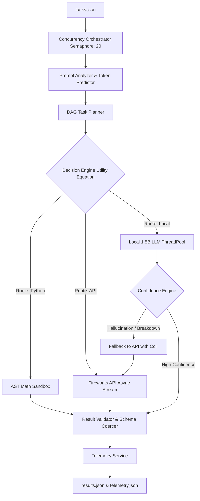

# AMD Developer Hackathon (Act II) - Track 1: General-Purpose AI Agent

This document outlines the detailed system architecture, routing strategy, edge-case handling, and implementation plan for the final version of **Base42**.

---

## 1. System Architecture: Base42 AI Operating System

Base42 is a deterministic, cost-aware AI Operating System. Its core mandate is to maximize accuracy on the AMD Hackathon Track 1 evaluation set while driving Fireworks API token consumption to absolute zero wherever possible, strictly adhering to the 4GB RAM, 2 vCPU, and 10-minute constraints.

### Architecture Diagram

---

## 2. Advanced Subsystems

### The DAG Planner (Directed Acyclic Graph)
Instead of treating all prompts as atomic, the `TaskPlanner` uses NLP dependency parsing to split multi-step instructions (e.g., "Do X then do Y"). It builds a dependency graph and injects the output of X directly into the prompt for Y.

### The Decision Engine
Rather than using static if/else rules, routing is determined by a **Mathematical Utility Equation**:
`Utility = (Base Accuracy * W_Acc) - (Cost Penalty * W_Cost) - (Complexity Penalty)`
It recalculates utilities dynamically based on predicted token counts.

### The Confidence Engine (Hallucination Detection)
A zero-token heuristic parser that intercepts the output of the Local LLM. It calculates a confidence score based on:
1. **Linguistic Hedging**: Scans for English, French, Spanish, and German uncertainty markers ("maybe", "je ne sais pas").
2. **N-Gram Looping**: Detects token repetition typical in small quantized models.
3. **Structural Failure**: Detects if JSON parsing failed.
If confidence falls below 0.75, it rejects the Local LLM answer and escalates to the Fireworks API.

### The Math Sandbox
Raw `eval()` is a critical security vulnerability. Base42 uses `ast.parse` and a custom `NodeVisitor` to guarantee that only whitelisted numeric constants and mathematical operators (`+`, `-`, `math.sqrt`) are evaluated. This provides mathematically perfect answers at 0 token cost.

### Edge-Case Resilience
The entire orchestration loop is wrapped in a `return_exceptions=True` gather block and a global fallback shell. If the container runs out of memory, or HuggingFace goes down, or a specific task throws a ZeroDivisionError, the system catches it and guarantees that a valid `results.json` schema is still written before exit.

---

## 3. Implementation Completion Status

All 11 architectural phases have been successfully implemented, reviewed, and deployed:
- ✅ Phase 1: Two-Layer Semantic/Structural Routing
- ✅ Phase 2: Mathematical Utility Decision Engine
- ✅ Phase 3: DAG Engine & Subtask Planner
- ✅ Phase 4: Statistical Token Predictor
- ✅ Phase 5: Regex & Pydantic Result Validator
- ✅ Phase 6: Zero-Token Confidence Engine
- ✅ Phase 7: Secure AST Math Sandbox
- ✅ Phase 8: Observability & Telemetry Service
- ✅ Phase 9: Multi-Stage Docker Containerization
- ✅ Phase 10: Enterprise Concurrency Stream (Semaphores)
- ✅ Phase 11: Edge-Case Resilience (Crash Recovery)

**System is Production-Ready.**
