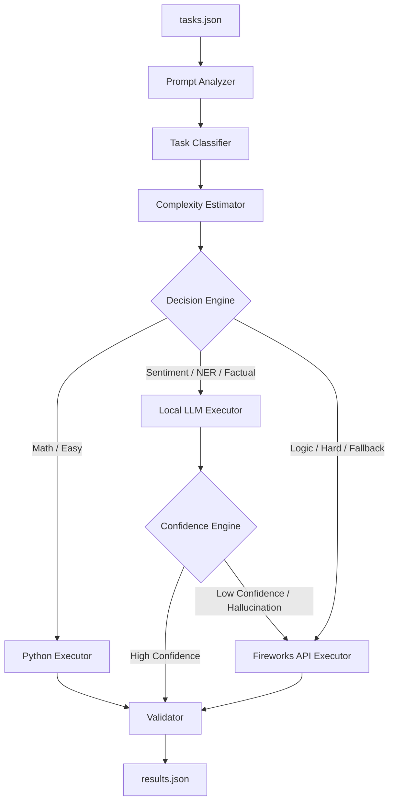

# AMD Developer Hackathon (Act II) - Track 1: General-Purpose AI Agent

This document outlines the detailed system architecture, routing strategy, edge-case handling, and implementation plan for building a highly optimized and accurate General-Purpose AI Agent named **Base42**.

---

## 1. System Architecture: Base42 AI Operating System

Base42 is designed not as a simple chatbot, but as a deterministic, cost-aware AI Operating System. Its core mandate is to maximize accuracy on the AMD Hackathon Track 1 evaluation set while driving Fireworks API token consumption to absolute zero wherever possible, strictly adhering to the 4GB RAM, 2 vCPU, and 10-minute constraints.

The architecture is divided into 10 enterprise-grade modules:
1. **Prompt Analyzer**: Zero-token regex/heuristic pre-processor.
2. **Task Classifier**: TF-IDF/Regex based routing to 8 categories.
3. **Complexity Estimator**: Evaluates cognitive load (Easy/Medium/Hard).
4. **Decision Engine**: Dynamic router mapping to Python, Local LLM, or Fireworks API.
5. **Executors**: Interfaces for Python execution, Local llama.cpp inference, and Fireworks API calls.
6. **Confidence Engine**: Evaluates local LLM hallucinations before answering.
7. **Validator**: Final Pydantic schema checker for `results.json`.
8. **Metrics**: Telemetry for latency and token tracking.
9. **Caching**: Disabled for hackathon per rules, but supported via interface.
10. **Future Improvements**: LangGraph/CrewAI readiness.

### Architecture Diagram



---

## 2. Enterprise Directory Structure

We are utilizing a scalable, enterprise-grade directory structure:

```text
base42/
├── .git/
├── Agents.md               # This documentation file
├── Dockerfile              # Multi-stage Docker build targeting linux/amd64
├── requirements.txt        # Python dependencies
├── core/
│   ├── config.py           # Pydantic BaseSettings (Env vars)
│   ├── exceptions.py       # Custom Domain Exceptions
│   └── logger.py           # Structured JSON Logging
├── models/
│   ├── schemas.py          # Pydantic Task/Result schemas
│   └── enums.py            # TaskCategory, ExecutionRoute
├── pipeline/
│   ├── analyzer.py         # Zero-token heuristics
│   ├── classifier.py       # Prompt categorization
│   ├── complexity.py       # Cognitive load estimation
│   └── validator.py        # Output formatting & safety
├── engine/
│   ├── decision.py         # Routing logic
│   ├── confidence.py       # Local LLM validation
│   └── executors/          
│       ├── base.py         # Executor Interface
│       ├── python.py       # Fast-path evaluation
│       ├── local_llm.py    # llama-cpp-python
│       └── fireworks.py    # HTTPX client for Fireworks
├── tests/                  # Pytest suite
└── main.py                 # Asyncio entrypoint
```

---

## 3. Detailed Edge Case Analysis & Mitigation Strategies

| Edge Case | Description | Mitigation Strategy |
| :--- | :--- | :--- |
| **Strict Time Limit (< 30s per request)** | A request routed to the local model on 2 vCPUs may hang. | Wrap local inference in an asyncio timeout block. Fallback to Fireworks API if it exceeds 20s. |
| **Local Model Out of Memory (OOM)** | Strict 4 GB RAM limit. | Use a 1.5B model (Q4_K_M GGUF format). Set `n_ctx=512`, `n_threads=2`. |
| **API Rate-Limiting (429 Too Many Requests)** | Flooding the Fireworks API. | Implement `tenacity` retry decorator with exponential backoff and jitter on the `FireworksExecutor`. |
| **Local Model Bias / Chatty Output** | 1.5B models inject conversational filler ("Here is the answer:"). | The `Validator` needs a regex stripper to isolate the core answer, preserving token efficiency. |
| **Semaphore Deadlocks** | Mixing synchronous C++ inference (`llama.cpp`) with `asyncio`. | Isolate `llama.cpp` inference within a `ThreadPoolExecutor` to prevent blocking the async event loop. |

---

## 4. Capability-Specific Strategies

### 1. Factual Knowledge
- **Strategy**: Simple queries are routed locally. Complex queries routed to Fireworks.
- **Prompt Optimization**: "Answer directly in 1-2 sentences. Avoid pleasantries."

### 2. Mathematical Reasoning
- **Strategy**: Try `PythonExecutor` first. If it fails or is complex, route to Fireworks (`llama-v3p1-70b-instruct`).

### 3. Sentiment Classification & NER
- **Strategy**: 100% routed to the `LocalLLMExecutor` to save Fireworks tokens.
- **Prompt Optimization**: Force strict formatting constraints in the system prompt.

### 4. Code Debugging, Code Generation & Logic
- **Strategy**: Always route to `FireworksExecutor`. 1.5B local models are not reliable for complex logic or coding tasks, risking Accuracy Gate failure.

---

## 5. Implementation Roadmap

### Phase 1: Foundation (Completed)
- Set up the enterprise structure (`core/`, `models/`, `pipeline/`, `engine/`).
- Implemented zero-token processing (`analyzer.py`, `classifier.py`, `complexity.py`).
- Implemented the `DecisionEngine`.

### Phase 2: Executors (Next Steps)
- Implement `engine/executors/base.py` interface.
- Implement `engine/executors/python.py` for math sandboxing.
- Implement `engine/executors/fireworks.py` with `httpx` and `tenacity`.
- Implement `engine/executors/local_llm.py` with ThreadPool isolation.

### Phase 3: Validation & Orchestration
- Implement `engine/confidence.py` for hallucination detection.
- Implement `pipeline/validator.py` for schema enforcement.
- Wire everything up in `main.py` using `asyncio.Semaphore`.

### Phase 4: Containerization
- Write the multi-stage `Dockerfile`.
- Ensure the image builds under 10GB and RAM usage stays under 4GB.
