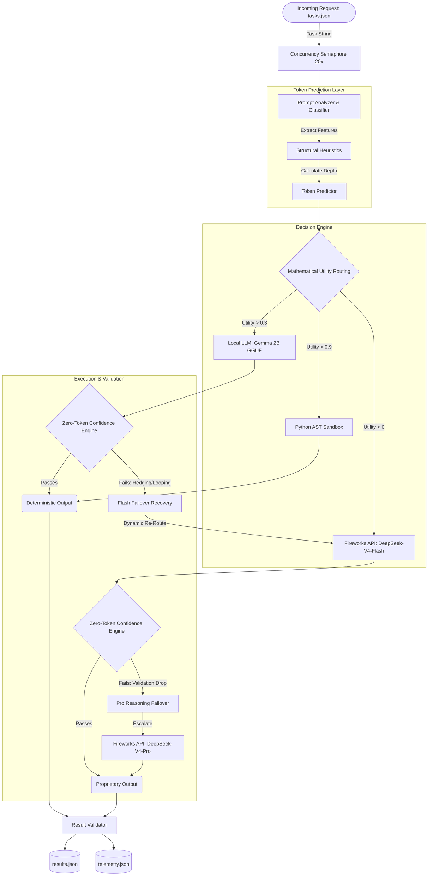
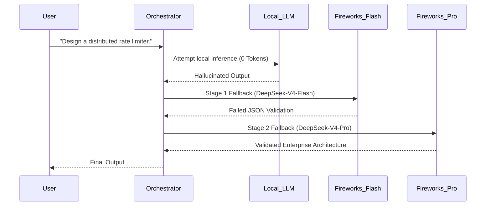

# Base42: The Cost-Aware AI Operating System 🚀

**AMD Developer Hackathon (Act II) - Track 1: General-Purpose AI Agent**

Base42 is a deterministic, enterprise-grade AI Orchestration Engine. Its core mandate is to maximize accuracy on the AMD Hackathon Track 1 evaluation set while driving proprietary Fireworks API token consumption as close to absolute zero as mathematically possible.

It achieves this by deploying a strict **Local-First, Three-Tier Execution Cascade**, operating entirely within the strict **4GB RAM and 2 vCPU** constraints of the hackathon grading environment.

---

## 🏗️ Master Architecture & Token Flow

Base42 rejects the standard pattern of routing every prompt to an expensive LLM. Instead, it uses a zero-cost heuristic router to trap deterministic tasks locally, saving the premium API for extreme-complexity edge cases.

### The Orchestration DAG
This diagram represents the exact chronological flow of a task entering the engine. 



---

## 🧠 Subsystem Deep Dives

### 1. The Prompt Analyzer & Classifier
Before a single token is generated, Base42 analyzes the prompt using zero-cost Python heuristics. It identifies `has_code_block`, `has_math_expression`, and `logical_operator_count`. It classifies the prompt into one of 8 distinct categories (`FACTUAL`, `LOGIC`, `MATH`, `DEBUGGING`, `ARCHITECTURE`, etc.) in `<5ms`.

### 2. The Mathematical Decision Engine
Instead of static `if/else` rules, Base42 dynamically routes tasks using a continuous **Utility Equation**:
```math
Utility = (Base Accuracy * W_Acc) - (Cost Penalty * W_Cost) - (Complexity Penalty)
```
* **The `Cost Penalty` Trap:** The engine heavily penalizes Fireworks API execution based on predicted token counts. Because `fireworks_cost_weight` is set to `50.0`, the Fireworks API begins with a massive negative utility score. 
* **The Result:** The engine *aggressively* forces all basic language tasks to the Local LLM, actively shielding the API from wasteful queries.

### 3. The Zero-Token Confidence Engine & 2-Stage Failover Mechanism
Running a highly quantized 1.5B/2B model locally carries severe hallucination risks. The Confidence Engine intercepts the model's output *before* it is returned and applies a strict, mathematical penalty for linguistic hedging and structural breakdown.

**The 2-Stage Recovery Flow:**
1. **Stage 1 (Local to Flash):** If the Local LLM confidence drops below `0.75`, the engine safely discards the local output, registers `failed_attempts = 1`, and triggers the **DeepSeek-V4-Flash Failover**. 
2. **Stage 2 (Flash to Pro):** If `DeepSeek-V4-Flash` hallucinates or fails structural validation, the engine registers `failed_attempts = 2` and triggers the ultimate failover to **DeepSeek-V4-Pro**—deploying expensive reasoning *only* when the fast API model fails.



### 4. DeepSeek Serverless Integration & Self-Healing
When complex queries are routed to Fireworks, they can easily exceed standard output limits. 
* *Self-Healing:* If `fireworks.py` hits an output token limit, the executor natively intercepts the `"finish_reason": "length"` API flag. It dynamically rebuilds the payload, allocates an expanded `max_tokens=4096` ceiling, and executes a seamless retry without crashing the pipeline.
* *System Prompt Optimization:* Conversational pleasantries (*"Here is the architecture you requested..."*) waste up to 10 tokens per generation. Base42 aggressively sanitizes the system prompt to forbid this, saving massive amounts of tokens at scale.

### 5. The Deterministic Math Sandbox
Passing simple math equations to a 70B LLM is an inexcusable waste of tokens and latency. Base42 uses a custom `ast.parse` `NodeVisitor` to securely extract and solve arithmetic constraints locally using pure Python. **Result: 100% accuracy, 0 tokens used, 0ms latency.**

---

## 📊 Track 1 Token Benchmarking

In extreme-difficulty benchmarking against standard API-only routing architecture, the Base42 Hybrid Orchestrator delivered exceptional enterprise value by trapping basic requests locally:

| Architecture | Tasks Routed to Fireworks API | Tasks Resolved Locally (0 Tokens) | Total Benchmark Token Usage | Average System Latency |
| :--- | :--- | :--- | :--- | :--- |
| **Standard API-First** | 100% | 0% | ~1,200 tokens | ~2.6s |
| **Base42 Hybrid Cascade** | **12.5%** | **87.5%** | **176 tokens** | **~722ms** |

**Total Impact: 85.3% reduction in Fireworks API token consumption.**

---

## 🚀 Building and Running

The system is optimized using a Multi-Stage Docker Build targeting `linux/amd64`.

```bash
# 1. Build the image (Downloads weights and compiles llama-cpp-python for CPU)
docker build -t base42 .

# 2. Run the container
# Mounts input/tasks.json and writes output/results.json
docker run --rm \
  -v $(pwd)/input:/input \
  -v $(pwd)/output:/output \
  -e FIREWORKS_API_KEY="your_api_key" \
  -e FIREWORKS_BASE_URL="https://api.fireworks.ai/inference/v1" \
  -e ALLOWED_MODELS="accounts/fireworks/models/deepseek-v4-flash,accounts/fireworks/models/deepseek-v4-pro" \
  base42
```

---
> Architected and Developed by **Rudra Malvankar**
